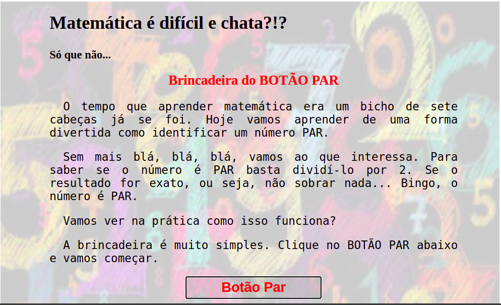
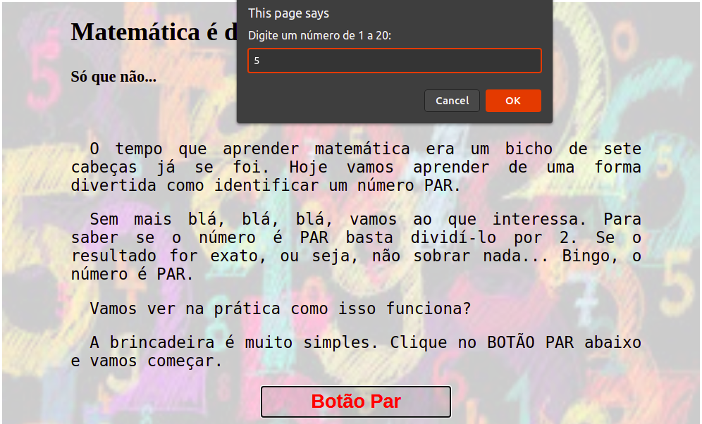
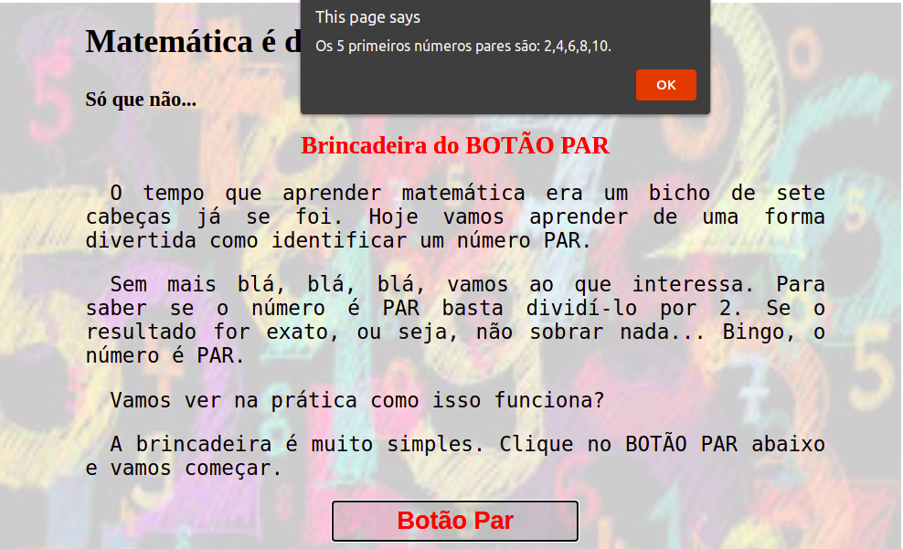

# Numeros Pares
 Projeto JS_01
 O usuário clica no botão PAR e é disparado um alerta solicitando que seja digitado um número de 1 a 20.
 O programa exibirá tantos números pares quanto o número que o usário digitou.
 
 
 
